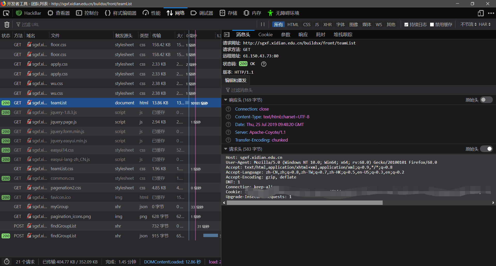

# 选房小技巧(仅供参考)

> 以下内容仅供参考，希望为大家选房提供参考，还有很多地方没有提及，欢迎各路大神 补充

### URL汇总

+ 登录入口

http://sgxf.xidian.edu.cn/Hall/serviceSupervision/portal

+ 网信院男生楼层 丁香14#

http://sgxf.xidian.edu.cn/buildsx/front/myFloor?building=AAAAAAAAAAAAAAAAAAAAAAAAAAA20514&floor=6

+ 团队列表

http://sgxf.xidian.edu.cn/buildsx/front/teamList

+ 发起组团（失效）

http://sgxf.xidian.edu.cn/buildsx/front/launchTeam

+ 查看团的信息：

http://sgxf.xidian.edu.cn/buildsx/frontChooseRoomGroup/myTeamDetail?teamId=XXX

+ 选房结果

http://sgxf.xidian.edu.cn/buildsx/front/myRoomDo

### 网站异常说明

目前遇到的异常：

+ 连接被重置，ping不通

  这代表服务器关闭或者太忙了

+ 500错误

  说明服务器还活着……

遇到这些错误就刷新，直到出现正常页面为止

### 选房技巧

#### 获取cookies

首先访问登录入口 http://sgxf.xidian.edu.cn/Hall/serviceSupervision/portal，登录

其次浏览器访问URL http://sgxf.xidian.edu.cn/buildsx/front/XX ，F12开发人员工具打开，在Network一栏查看数据包，只要是有返回的，URL可以选择

http://sgxf.xidian.edu.cn/buildsx/assets/xagyxt/wsxf/css/common.css

http://sgxf.xidian.edu.cn/buildsx/front/mySelectBedfromHallNewportal#

找200的数据包，点开，在右侧消息头 中 请求头中，找Cookie字段就是cookies信息



#### 找房间的URL

> 可能不太完善，仅供参考

```
# 丁香14# 基本格式
http://sgxf.xidian.edu.cn/buildsx/front/myRoom?id=RRRRRRRRRRRRRRRRRRRR20514{section}R{room_no}-{part}
# {section}是区号，I区还是II区，用1或者2代替
# {room_no}是房间号
# {part}1代表左，2代表右，3代表中
# 举例
# 1区111中
"http://sgxf.xidian.edu.cn/buildsx/front/myRoom?id=RRRRRRRRRRRRRRRRRRRR205141R111-3"
```

如果有不对的地方，请自行访问进行查看

http://sgxf.xidian.edu.cn/buildsx/front/mybuild

#### 获得床位的ID

方法一：

直接访问 房间的URL，检查元素，查看id


这个结果表示，2号床位已经占了，看不到id，凡是没有被占的床位都会显示id的


方法二：

咨询已经选上的朋友，但只能看他所在房间的床位id

选上的朋友访问，http://sgxf.xidian.edu.cn/buildsx/front/myRoomDo，同样检察元素也能得知床位id

#### 选房接口

请求网址:[http://sgxf.xidian.edu.cn/buildsx/front/saveMyBed](qq://txfile/#)
请求方法:POST

参数：

```shell
# POST 参数
'bedId':xx

# 传递Cookies
JSESSIONID=xxx; 
BIGipServersgxf.xidian.edu.cn=xxx; 
uid=xxx',
```

参考Python脚本

```python
import requests
from requests.exceptions import ConnectionError
import time
count = 0
my_headers={
    'Host':'sgxf.xidian.edu.cn',
    'User-Agent':'Mozilla/5.0 (Windows NT 10.0; Win64; x64; rv:68.0) Gecko/20100101 Firefox/68.0',
    'Accept':'*/*',
    'Accept-Language':'zh-CN,zh;q=0.8,zh-TW;q=0.7,zh-HK;q=0.5,en-US;q=0.3,en;q=0.2',
    'Accept-Encoding':'gzip, deflate',
    # TODO:加入房间的URL
    'Referer':'',
    'Content-Type':'application/x-www-form-urlencoded; charset=UTF-8',
    'X-Requested-With':'XMLHttpRequest',
    'Content-Length':'38',
    'DNT':'1',
    # TODO: 加入Cookies
    'Cookie':'',
    'Connection':'keep-alive',
}
def saveMyBed():
    try:
        global count
        count = count + 1
        print('post...%d' % count)
        res = requests.post(
            url='http://sgxf.xidian.edu.cn/buildsx/front/saveMyBed',
            # TODO: 加入床位id
            data={'bedId':''},
            headers = my_headers)
        if res.status_code == 200:
            print(res.text)
            if '选房成功'  in res.text:
                print('success')
                return True
            else:
                print(res.text)
                return False
            # saveMyBed()
        else:
            print('retry...')
            return False
            # saveMyBed()
    except ConnectionError as e:
        print(e)
        time.sleep(10)
        return False
        # saveMyBed()
if __name__ == '__main__':
    while True:
        flag = saveMyBed()
        if flag:
            print('成功！')
            break
```

### 查看自己的选房结果

http://sgxf.xidian.edu.cn/buildsx/front/myRoomDo

### 退团参考

首先在团队列表 http://sgxf.xidian.edu.cn/buildsx/front/teamList 刷出来自己的团队，检察元素查看链接地址，提取出teamId

然后访问 http://sgxf.xidian.edu.cn/buildsx/frontChooseRoomGroup/myTeamDetail?teamId=XXX

里边有退团按钮，由于本人当时没有分析退团的数据包，因此没办法分享接口。
